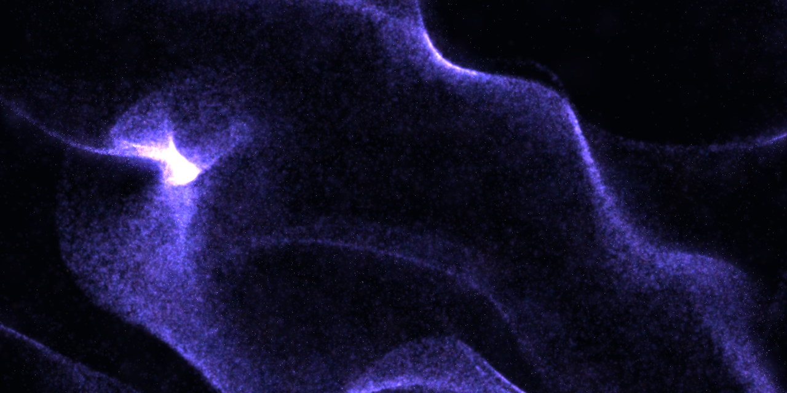
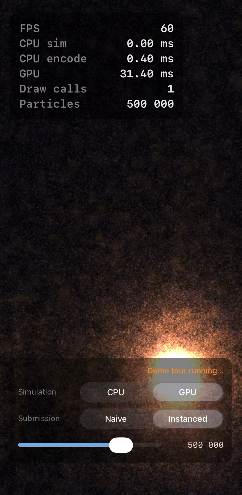
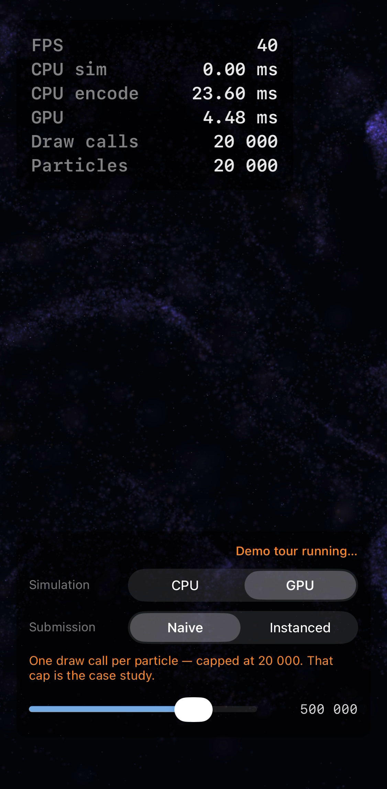

# Cosmic Dust

An interactive nebula of up to a million GPU particles for iPhone — and a set of **measured before/after case studies** in making Metal fast on Apple silicon.

The twist: every naive implementation **ships inside the app** behind a live toggle. Flip a switch, watch the frame time change on the built-in HUD, and reproduce every number below on your own phone. The case studies are the product; the app is the evidence.

  
  &nbsp;&nbsp;
  

## Measured results

iPhone 13 mini (A15, 60 Hz display), Release build, device cool and off the charger. All numbers come from one continuous screen-recorded run of the in-app demo tour — the video *is* the measurement protocol.

| Mode | Particles | FPS | The telling number |
|---|---|---|---|
| **Naive submission** — one draw call per particle | 20 000 (hard cap) | 40 | CPU encode **23.60 ms**, 20 000 draw calls |
| **Instanced submission** — one draw call total | 500 000 | 60 | CPU encode **0.40 ms**, 1 draw call |
| **CPU simulation** — single-threaded Swift loop + full 32 MB buffer re-upload per frame | 20 000 (hard cap) | **6** | **170.6 ms** of simulation per frame |
| **GPU simulation** — compute kernel, particles never leave the GPU | 500 000 | 60 | 0.00 ms CPU, GPU 16.3 ms |

## Case study 01 — 20 000 draw calls → 1

The naive first version submits one `drawPrimitives` per particle. The GPU is nearly idle (4.5 ms) while the CPU spends 23.6 ms per frame just dictating commands — and the particle count hits a hard wall at 20k.

The fix is the canonical one: a single instanced draw, with the vertex shader pulling each particle from a `MTLBuffer` by `instance_id`. Encode cost drops ~60×, the ceiling moves from 20k to 500k+ at 60 fps.

## Case study 02 — CPU simulation → GPU compute

The same physics (multi-octave curl-noise flow field, gravity wells, semi-implicit Euler), written the way a first version honestly gets written: a Swift loop over an array, then a full-buffer upload, every frame. At just 20k particles that costs 170 ms per frame — 6 fps.

Moved into a Metal compute kernel with particle state permanently resident on the GPU, the CPU's per-frame contribution drops to a 52-byte uniforms struct. Same visual result, 500k particles, 60 fps.

## Try it

Open `CosmicDust.xcodeproj`, run on a device (simulator works but its performance numbers are fiction — that's a lesson this project measured the hard way). 

- **Toggles**: Simulation CPU/GPU and Submission Naive/Instanced, live, with a particle-count slider (1k–1M).
- **▶ Demo tour**: a scripted 21-second pass through every mode — made for hands-free screen recordings.
- Touch and drag: gravity well.
- **✦ Live wallpaper**: records three seconds and saves it to Photos as a Live Photo — iOS takes that as an animated Lock Screen wallpaper.

## What the numbers already say comes next

At 1 000 000 particles the current renderer takes **63 ms of GPU time** (~15 fps) on A15. The two suspects are already identified and measured: a fat 32-byte AoS particle struct (memory bandwidth) and heavy overdraw from large soft sprites. Fixing those — SoA layout with packed half-precision fields, half-resolution HDR compositing, size/brightness LOD — is the next set of case studies. The million runs at 60 when it's earned.

Also on the list: linear-light accumulation + tonemapping (the blown-white well core is a known artifact, not a feature), GPU-driven indirect draws, and a 30-minute thermal soak with an adaptive quality governor — early runs already showed encode time drifting 4→25 ms with device heat, which is exactly why every number above states its thermal protocol.

---

*Swift + Metal, no dependencies. Built as a portfolio project: the goal is not a particle demo, but a public record of finding real bottlenecks with a profiler and fixing them with measurements to show for it.*
